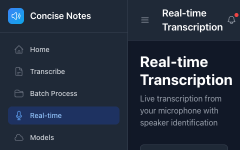

# Concise Note Taker - Visual Guide

Generated on 8/21/2025

## Application Screenshots

### Home Page

Main dashboard showing quick actions and system status

---

### Transcribe Page

Main transcription interface for single files

---

### Batch Processing

Process multiple files at once

---

### Real-time Transcription

Live microphone transcription interface

---

### Model Management

Download and manage Whisper models

---

### Settings

Application configuration and preferences

---

### Transcription Options

Showing expanded transcription options

---

## Screenshot Gallery

  
  
Home Page

  
  
Transcribe Page

  
  
Batch Processing

  
  
Real-time Transcription

  
  
Model Management

  
  
Settings

  
  
Transcription Options

